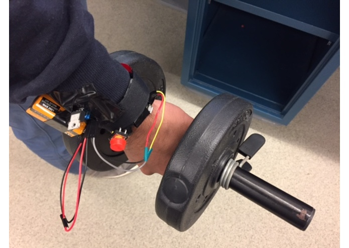

PROJECT Fit-O-Philia
============

**University of Pennsylvania, ESE 519: Real Time and Embedded Systems**

* Fan Zhang, Karthik Anantha Ram & Sanjeet Phatak
* https://devpost.com/software/cloud-based-dumbbell-activity-tracker

### DESCRIPTION AND GOALS
The objective of the project is develop an  independent system that assists a user during his/her workout routine. The system provides fitness solutions by delievering media content, recives feeback on how the user is working out through the wearbale devices and head gear, dynamically adpats and indicates to the user on where he/she is going wrong in the excercise tby performing statistical analysis on the IMU data gathered from the interactive devices.

### VIDEO
https://www.youtube.com/watch?v=ztR8gBI4WXw&feature=youtu.be

### IMAGES and GIFs

